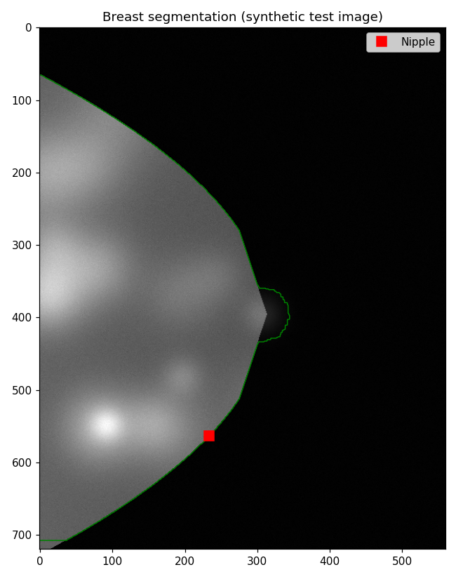
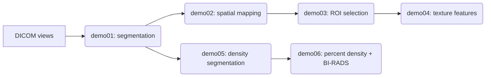
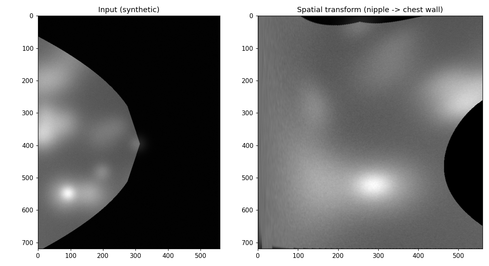
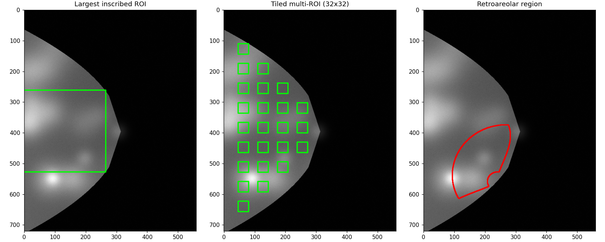
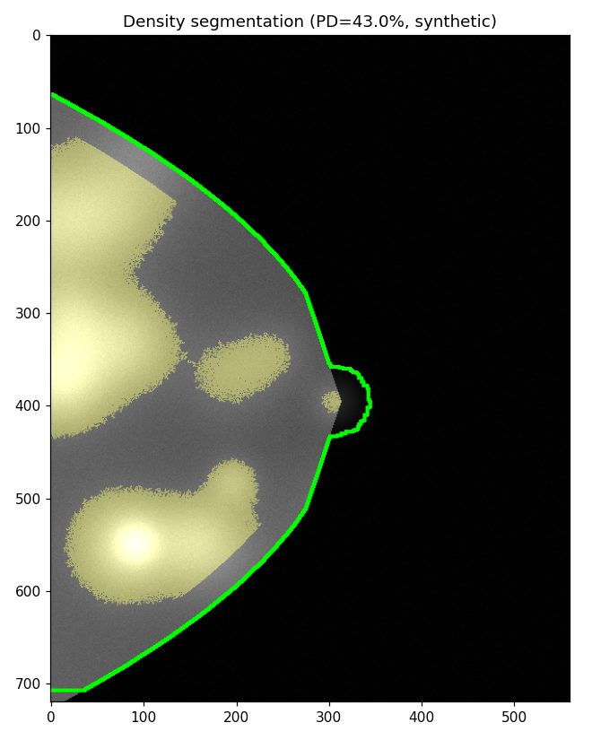

<p align="center"></p>

<h1 align="center">breast-radiomics</h1>

<p align="center">A Python rewrite of the <strong>OpenBreast</strong> MATLAB toolbox for quantitative mammogram analysis: breast segmentation, spatial normalization, ROI selection, radiomic texture features, and morphology based percent density / BI-RADS reporting.</p>

<p align="center">


</p>

---

## Contents

- [What it does](#what-it-does)
- [Pipeline](#pipeline)
- [Setup](#setup)
- [Running it](#running-it)
- [Project layout](#project-layout)
- [Status](#status)

## What it does

You give it a folder of DICOM views for one patient (left/right, CC/MLO), and it walks through six stages:

1. finds the breast silhouette and chest wall line
2. warps the breast into a normalized nipple to chest wall coordinate system, so tissue at the "same" anatomical location can be compared across patients regardless of breast size or shape
3. pulls regions of interest out of that normalized space: the largest inscribed square, a tiled grid of 32x32 patches, and the retroareolar region
4. computes texture statistics over those regions (gray level co-occurrence, run length, histogram, and fractal dimension features)
5. segments the dense fibroglandular tissue using a morphological area gradient threshold
6. rolls the per view results up into a percent density number and a BI-RADS style category (A through D) per breast and per patient

Every stage has a standalone demo script under [`demos/`](demos/) you can point at a single patient folder, and each one saved a figure so you can actually see what the step produced instead of trusting a number.

## Pipeline



<details open>
<summary><strong>1. Segmentation</strong> (<code>demo01.py</code>)</summary>
<br>

Finds the breast outline, the chest wall (on MLO views), and the nipple position. Everything downstream depends on getting this right.


<sub>Figure built from a fabricated test image, not a real mammogram. See <a href="#status">Status</a>.</sub>
</details>

<details>
<summary><strong>2. Spatial mapping</strong> (<code>demo02.py</code>)</summary>
<br>

Re-parametrizes the segmented breast into a normalized (s, t) grid running from the nipple to the chest wall, so the same tissue location means the same thing across different breast shapes and sizes.


</details>

<details>
<summary><strong>3. ROI selection</strong> (<code>demo03.py</code>)</summary>
<br>

Three ways of picking a region to analyze: the largest square that fits entirely inside the breast, a tiled grid of fixed size patches, and the retroareolar region defined directly in the normalized coordinate space.


</details>

<details>
<summary><strong>4. Texture features</strong> (<code>demo04.py</code>)</summary>
<br>

Extracts gray level co-occurrence (GLCM), run length (GLRL), histogram (GLHA), gray level sum/difference (GLSM), and fractal dimension features at multiple scales and normalizations, and writes them out as a per patient CSV. No figure here, just numbers.
</details>

<details>
<summary><strong>5. Density segmentation</strong> (<code>demo05.py</code>)</summary>
<br>

Thresholds dense fibroglandular tissue by finding where the area-vs-intensity curve drops fastest (the morphological area gradient), then cleans the result up with a skin gap erosion and small region removal.


</details>

<details>
<summary><strong>6. Percent density and BI-RADS report</strong> (<code>demo06.py</code>)</summary>
<br>

Combines the density segmentation across all views of a patient into a per breast and per patient percent density, and buckets it into a BI-RADS category (A: predominantly fatty, through D: extremely dense). Writes a plain text clinical style report per patient.
</details>

## Setup

Needs Python 3.9+.

```bash
pip install -r requirements.txt
```

Core dependencies: `numpy`, `scipy`, `scikit-image`, `pydicom`, `matplotlib`, `opencv-python`.

## Running it

Each demo takes a `--folder` pointing at a directory of DICOM files for one patient and writes its output next to wherever you point `--output` (or the current directory if you don't):

```bash
python demos/demo01.py --folder "path/to/patient_folder"
python demos/demo02.py --folder "path/to/patient_folder"
python demos/demo03.py --folder "path/to/patient_folder"
python demos/demo04.py --folder "path/to/patient_folder"
python demos/demo05.py --folder "path/to/patient_folder"
python demos/demo06.py --folder "path/to/patient_folder"
```

Your own DICOM data stays local. The `samples/`, `data/`, `prediction/`, and `predict/` folders are gitignored on purpose, nothing patient related gets committed.

## Project layout

<details>
<summary>expand</summary>

```
misc/          core utilities: DICOM reading, metadata parsing, image normalization
segmentation/  breast and chest wall segmentation
mapping/       spatial coordinate transforms (forward and inverse)
density/       morphological dense tissue segmentation
features/      radiomic texture feature extractors (GLCM, GLRL, GLHA, GLSM, fractal dimension)
mpatterns/     micro pattern / texton modeling
demos/         the six standalone, end to end demo scripts described above
support/       reference algorithms used internally (largest inscribed square/rectangle, risk assessment plotting)
```

</details>

## Status

This is a research port, written by translating the original MATLAB functions one at a time, not a validated or cleared medical device. The figures above come from a fabricated test pattern built specifically for this README, not a real mammogram: the pipeline itself only ever runs on whatever DICOM folder you point it at, and nothing patient related ships in this repo.
