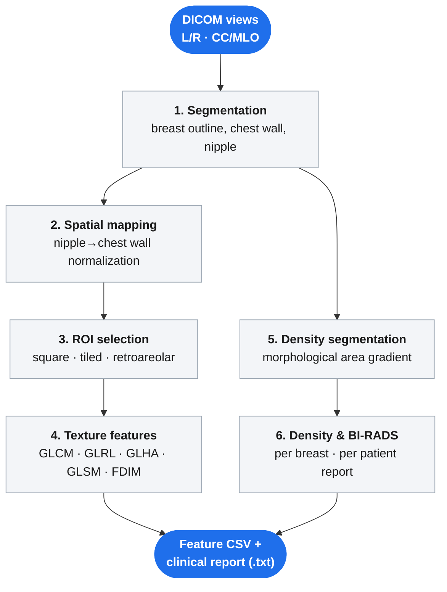

<p align="center"></p>

<h1 align="center">breast-radiomics</h1>

<p align="center">
A Python implementation of the <strong>OpenBreast</strong> mammography analysis toolbox (originally MATLAB), covering breast segmentation, spatial normalization, ROI extraction, radiomic texture features, and morphology based breast density / BI-RADS reporting.
</p>

<p align="center">


</p>

---

## Table of contents

- [Overview](#overview)
- [Key features](#key-features)
- [Workflow](#workflow)
- [Installation](#installation)
- [Usage](#usage)
- [Output](#output)
- [Project structure](#project-structure)
- [Limitations](#limitations)

## Overview

Mammogram interpretation relies on quantitative measures that are tedious to compute by hand: the breast outline and chest wall position, a normalized coordinate system to compare tissue location across patients, texture statistics over specific regions, and an estimate of how much of the breast is dense fibroglandular tissue versus fat.

This project implements that pipeline end to end in Python, starting from raw FFDM DICOM files and ending in a per patient percent density figure and a BI-RADS category (A through D). Each stage was ported directly from the original OpenBreast MATLAB functions, one function at a time, so the underlying math matches the reference implementation.

## Key features

- Automatic breast silhouette, chest wall, and nipple detection from FFDM DICOM images
- Spatial normalization into a nipple to chest wall coordinate system, enabling tissue comparison across different breast sizes and shapes
- Three ROI extraction strategies: largest inscribed square, tiled fixed size patches, and the retroareolar region
- Over 60 radiomic texture features: GLCM, GLRL, GLHA, GLSM, and fractal dimension, at multiple scales and normalizations
- Morphological dense tissue segmentation using an area gradient threshold
- Per breast and per patient percent density aggregation with automatic BI-RADS categorization
- A single orchestrator script that runs the full pipeline across an entire folder of patients, with per patient error isolation

## Workflow



Stages 1 to 4 (segmentation through texture features) and stages 1, 5, 6 (segmentation through density reporting) can be thought of as two branches off the same breast mask: one characterizes texture, the other characterizes density. `master_pipeline.py` runs both branches, for every view, for every patient, in one pass.

<table>
<tr>
<td width="50%">

**1. Segmentation**
<br>


</td>
<td width="50%">

**2. Spatial mapping**
<br>


</td>
</tr>
<tr>
<td width="50%">

**3. ROI selection**
<br>


</td>
<td width="50%">

**5. Density segmentation**
<br>


</td>
</tr>
</table>

<sub>Figures above were generated from a fabricated test image run through the real pipeline code, not a real mammogram. See <a href="#limitations">Limitations</a>.</sub>

## Installation

Requires Python 3.9 or newer.

```bash
git clone https://github.com/ZainabPervaiz-cloud/breast-radiomics.git
cd breast-radiomics
pip install -r requirements.txt
```

Core dependencies: `numpy`, `scipy`, `scikit-image`, `pydicom`, `matplotlib`, `opencv-python`.

## Usage

### Single stage, single patient

Each demo script takes `--folder` (a directory of DICOM files for one patient) and an optional `--output`:

```bash
python demos/demo01.py --folder "path/to/patient_folder"   # segmentation
python demos/demo02.py --folder "path/to/patient_folder"   # spatial mapping
python demos/demo03.py --folder "path/to/patient_folder"   # ROI selection
python demos/demo04.py --folder "path/to/patient_folder"   # texture features
python demos/demo05.py --folder "path/to/patient_folder"   # density segmentation
python demos/demo06.py --folder "path/to/patient_folder"   # percent density + BI-RADS
```

### Full pipeline, batch of patients

`master_pipeline.py` walks an entire input folder, groups DICOM containing view folders (such as `L MLO`, `R CC`) back up to their parent patient directory, and runs demo01 through demo06 for each patient it finds, mirroring the input structure into the output folder:

```bash
python master_pipeline.py --input "path/to/root/of/patients" --output "path/to/results"
```

One patient failing (a corrupt DICOM, an unreadable view) is caught and logged, and the batch continues with the next patient rather than stopping the run.

## Output

For each patient, the full pipeline produces:

| Path | Contents |
|---|---|
| `<output>/<patient_id>/demo01/` | Segmentation figures per view |
| `<output>/<patient_id>/demo02/` | Spatial mapping figures per view |
| `<output>/<patient_id>/demo03/` | ROI selection figures per view |
| `<output>/<patient_id>/demo04/` | `*_features.csv`, consolidated texture features |
| `<output>/<patient_id>/demo05/` | Density segmentation figures per view |
| `<output>/<patient_id>/demo06/` | Density/BI-RADS figures per view |
| `<output>/<patient_id>/<patient_id>.txt` | Clinical style report: per breast and per patient percent density, BI-RADS category |

## Project structure

```
misc/          core utilities: DICOM reading, metadata parsing, image normalization
segmentation/  breast and chest wall segmentation
mapping/       spatial coordinate transforms (forward and inverse)
density/       morphological dense tissue segmentation
features/      radiomic texture feature extractors (GLCM, GLRL, GLHA, GLSM, fractal dimension)
mpatterns/     micro pattern / texton modeling
demos/         six standalone, single stage demo scripts
support/       reference algorithms used internally (largest inscribed square/rectangle, risk assessment plotting)
master_pipeline.py   orchestrator: runs all six stages across every patient in an input folder
```

## Limitations

This is a research port, translated function by function from the original MATLAB implementation. It has not been validated against the reference MATLAB outputs, nor against any clinical ground truth, and it is not a cleared or certified medical device. The example figures in this README are generated from a fabricated test pattern built specifically for documentation purposes; no patient data, sample DICOM files, or real mammogram derived images are included anywhere in this repository.
